<table>
<colgroup>
<col style="width: 21%" />
<col style="width: 78%" />
</colgroup>
<tbody>
<tr>
<td rowspan="2"></td>
<td style="font-size: 24px;text-align: center;">
<strong>Manuel utilisateur du plugin
« Jeux d’attributs »</strong>

<strong>V0.3.0</strong>
</td>
</tr>
<tr>
<td style="font-size: 16px;text-align: center;">Développeur  : Gérôme PECHEUR (IGN)</td>
</tr>
</tbody>
</table>

## Sommaire

- [1. Prérequis](#prerequis)

- [2. Résumé](#resume)

- [3. Installation](#installation)

- [4. Présentation](#presentation)

 - [5. Configuration](#configuration)

 - [6. Utilisation](#utilisation)

 - [7. A propos](#a-propos)

  <h2 id="prerequis" style="color: white;margin:0;" >1. Prérequis</h2>

Version de QGIS : 3.28 ou supérieur, y compris QGIS4

Le plugin « maitre » doit préalablement être installé : 
[maitre-qgis-plugin sur GitHub](https://github.com/IGNF/maitre-qgis-plugin)

  <h2 id="resume" style="color: white;margin:0;" >2. Résumé</h2>

Ce plugin facilite la modification des attributs des entités.

  <h2 id="installation" style="color: white;margin:0;" >3. Installation</h2>

Le plugin s’installe soit en chargeant le zip dans QGIS, soit en lançant
l’exécutable d’installation : (\*\_PluginIGN_Installer.exe).

  <h2 id="presentation" style="color: white;margin:0;" >4. Présentation</h2>

A l’ouverture du plugin on obtient :

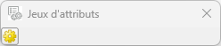

Ici, pas de configuration

Exemple après configuration :

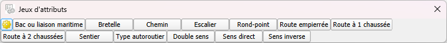

  <h2 id="configuration" style="color: white;margin:0;" >5. Configuration</h2>

 : Permet de configurer la
valeur d’un champ à modifier sur les entités sélectionnées dans QGIS

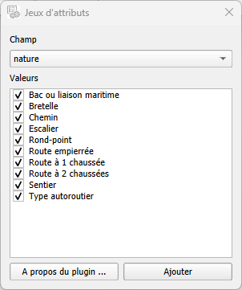

Les champs et les valeurs proposés correspondent à ceux de la couche
active.

Il est possible de passer d’une couche à une autre, l’interface
s’actualisera.

La validation via 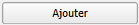, va ajouter des boutons pour
chaque valeur dans l’interface.

Il est possible d’y ajouter plusieurs valeurs pour un même champ.

Après configuration on obtient :

Une fois cette étape effectuée, il est possible de modifier le nom d’un
bouton, d’y ajouter une icône ou de lui associer d’autres attributs à
modifier

Pour ce faire, faites un clic droit sur un bouton :

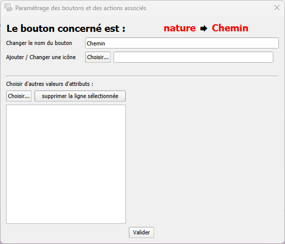

Un bouton doit avoir obligatoirement un nom et/ou une icône.

Si les deux sont renseigné, la priorité est l’icône.

On peut également choisir d’autre attributs à associer au bouton, via :
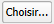

On obtient :

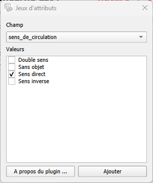

Cette fois-ci, vous ne pouvez sélectionner qu’une seule valeur par
champ, puisqu’une entité ne peut posséder qu’une seule valeur pour un
champ donné.

On obtient ainsi :

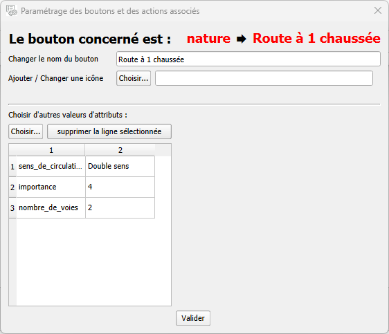

Répétez l’opération pour chaque bouton et pour chaque couche, si
nécessaire.

 

  <h2 id="utilisation" style="color: white;margin:0;" >6. Utilisation</h2>

Il est possible de réorganiser l’ordre des boutons par simple
glissé-déposé.

Clic gauche sur un bouton, on le déplace sur un autre bouton, il se
placera juste avant celui ci

Le survol d’un bouton affiche une info bulle avec toutes les valeurs des
différents champs pris en compte.

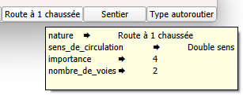

Dans QGIS, après la sélection d’une ou de plusieurs entités, l’appui sur
un bouton entraîne la modification sémantique correspondant à la
configuration du bouton activé.

  <h2 id="a-propos" style="color: white;margin:0;" >7. A propos</h2>

Accessible via  puis
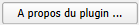

On obtient :

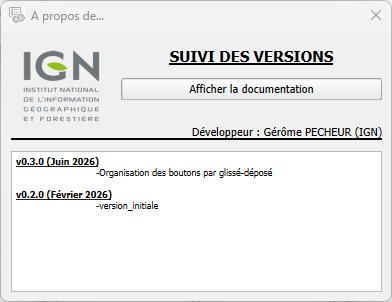

Cette boite permet de suivre l’historique des différentes versions ainsi
que d’afficher cette documentation.
